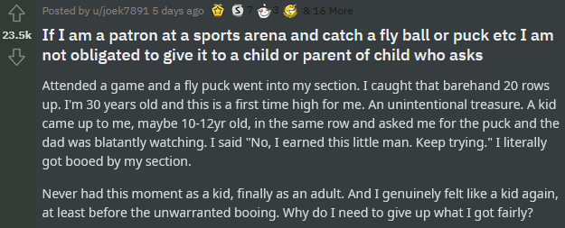
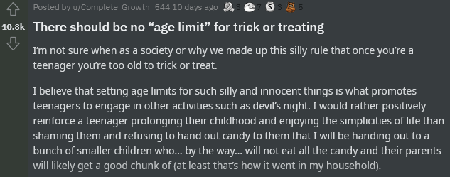
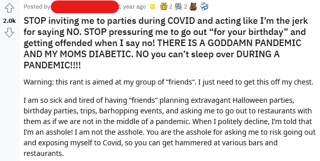
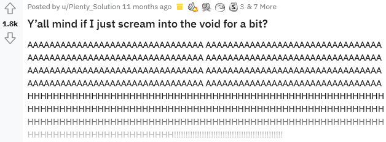

# Subreddit Classification
### by Steven Tran

| **Notebooks** |
|-----------|
|[01_Data_Collection](code/01_Data_Collection.ipynb)|
|[02_Cleaning_and_EDA.ipynb](code/02_Cleaning_and_EDA.ipynb)|
|[03_Preprocessing_Modeling_and_Tuning](code/03_Preprocessing_Modeling_and_Tuning.ipynb)|
|[04_Production_Model_and_Conclusion](code/04_Production_Model_and_Conclusion.ipynb)|

This project was initally one of my assignments while I attended the **General Assembly Data Science Immersive**. The project involves using natural language processing to solve a binary classification problem.

All continued development tasks listed below are revisions I made after submitting the assignment for review.

Please feel free to reach out if you have any questions.
[mrsteventran@gmail.com](mailto:mrsteventran@gmail.com)  
[LinkedIn](https://www.linkedin.com/in/steven-tran/)

---
### Continued development tasks

To do:
* Revise data collection script  
    * Collect more posts over a more stratified time period
* Try `CountVectorizer` with additional parameter combinations
    

Done:

---

## Using Natural Language Processing (NLP) to Discern what **Unpopular Opinions** are Made Of

The digital age has made it relatively easier to voice ideas and reach a large audience. Because of this, it can be sometimes be difficult to distinguish certain forms of expression. Social networks, discussion boards, or any virtual platforms which promote and moderate stratified discussion would benefit from a way to better distinguish between different forms of expression

## A Solution

We can use Natural Language Processing (NLP) to aid in identifying how specific words’ importance in a body of text can classify the writer/speaker as 
* expressing a controversial opinion or 
* simply ranting.

To train and validate the classificaion model, we'll need some data. For this project, I'll be relying on user-submitted text posts from the social media platform **Reddit**. [According to Wikipedia](https://en.wikipedia.org/wiki/Reddit), 

> Reddit is an American social news aggregation, web content rating, and discussion website \[where posts are \] organized by subject into user-created boards called "communities" or **"subreddits"**, which cover a variety of topics such as news, politics, religion, etc.

For this project, I'll be using the /r/UnpopularOpinion and /r/Rant subreddits from which to collect user text posts.

### Subreddit 1: /r/UnpopularOpinion
Our first subreddit contains texts which are **unpopular opinions**. The first rule of this subreddit reads as follows:

> Your post must be an opinion. Not a question. Not a showerthought. Not a rant. Not a proposal. Not a fact. An opinion. One opinion. A subjective statement about your position on some topic.

Some example /r/UnpopularOpinion posts:
* </img>
* </img>

### Subreddit 2: /r/Rants
The second subreddit contains texts which are rants. The team of moderators from this subreddit don't have an established rule for what constitutes a rant (as the /r/UnpopularOpinion mods did above), so I will refer to the [Dictionary.com](https://www.dictionary.com/browse/rant) definition of the verb form of the word "rant":

> to speak or declaim extravagantly or violently; talk in a wild or vehement way; rave

We can thus see that there is a distinction between the two forms of expression. One requires the statement of an opinion, whereas the other can conceivably include the definition of the first, but must be characteristically done in some extravagant or vehement way.

Some example /r/Rant posts (notice the abudance of upper-case and text-based yelling):  
*  
</img>
* (a personal favorite of mine)  
</img>

**DISCLAIMER**: None of the opinions or arguments presented in any of the collected posts necessarily reflect my own. I neither approve of nor condone any opinion calling for violence or expressing harmful, hateful, or ignorant sentiments toward any group or person.

---

## Data Collection

For this analysis, I collected 8,000 posts each from /r/UnpopularOpinion and /r/Rant using [Reddit's pushshift API](https://github.com/pushshift/api). I did my best in my API script to exclude any posts which may have been deleted by the original submitter or by a subreddit moderator. 

For reproducibility purposes, I wrote the script to collect valid posts which were created prior to January 1, 2021.

## Cleaning and EDA

I took the following data cleaning steps on each collected post:
1. Remove any urls
1. Remove newlines, special quotes, and zero-width space characters
1. Trim any leading or trailing whitespace
1. Remove NAs 
1. Remove any observations where the texts have been reduced to empty fields

At the conclusion of data cleaning, I managed to retain all 8,000 posts from /r/UnpopularOpinion and 7,715 posts from /r/Rant.

For exploratory analysis, I reviewed distributions of word counts and character counts in the posts' text fields, and conducted simple sentiment analysis to determine if any of these were strongly correlated with a post belonging to one subreddit or the other. 

The mild correlation results suggested that specific words and their importance would be better predictors of which subreddit a post belonged to.

## Preprocessing, Modeling, and Tuning

For preprocessing, I used tokenization and **Term Frequency-Inverse Document Frequency** (TFIDF) text vectorization to convert terms in our text posts into columns. The values in the columns denote how important to a document the term is relative to all documents in the corpus.

The posts (or observations) were split approximately evenly between /r/UnpopularOpinion and /r/Rant. I reserved about 25% of the observations for validation leaving 75% of the posts for model training. 

Then, for modeling, I deployed three classification models:
1. Logistic Regression
1. K-Nearest Neighbors (KNN)
1. XGBoost Ensemble

I trained a model using each classification algorithm on the same training data. Using grid search cross-validation for model tuning, I searched for set of vectorizer (TFIDF) and classifier hyperparameters which produced the best classification accuracy each model could achieve.

To decide which to use as the production model, I measured the each model's accuracy in classifying the reserved testing data. Compared to the Null Model where assuming every post belongs to /r/UnpopularOpinion with an accuracy of about 51%, I observed the following:
* KNN was the worst classifier, failing to achieve better classification accuracy than the Null Model
* LogisticRegression and XGBoost both outperformed the Null Model, and achieved similar accuracy in testing
    * However, the XGBoost classifications suffered from greater error due to variance indicating worse overfitting compared to the Logistic Regression model

**Therefore**, I chose the Logistic Regression model as the production model to aid in classifying speech as belonging to one subreddit or the other.

## Production Model and Conclusion

Using the best hyperparameters identified in the grid search I constructed a Logistic Regression model that could accurately classify which subreddit a post belonged to nearly 82% of the time.

The results of the production model -- in particular the accuracy the model attained in classifying 'unseen' text into the correct subreddit -- suggest we can be reasonably successful in building a classification model **that can predict whether a piece of text better belongs to the /r/UnpopularOpinion subreddit or the /r/Rant subreddit.**

Further, the identification of certain words whose *importance* (that is, how relevant they are in certain documents compared to others) in a text most positively or negatively affects the text's likelhood of being of a certain class suggests logistic regression can be used to aid in the identification and moderation of certain forms of speech.

For the two forms of speech this analysis examined, the expression of unpopular opinion and rants, the results showed:
* words establishing a position or how things should be ("shouldn't", "better", "best") being important to a text makes the text more likely to be an expression of unpopular, controversial, or dissenting opinion
* expletivies being important to a text makes it more likely that the text is a rant

### Recommendations

1. The furtherance of this type of machine learning work probably requires additional data and model training on a greater variety of *types of speech*. This analysis was limited only to the *expression of unpopular opinion* and *ranting* types of speech, but others exist and are deserving of their own classification.

1. The training and validation data were exclusive to a couple of months in the year 2020. A greater variety of training and validation data would be most helfpul in making this analysis more robust.

1. User-submitted text posts from Reddit may not be the gold standard for characterizing certain forms of speech. An exploration into other, richer potential data sources would be benfeficial to this work.